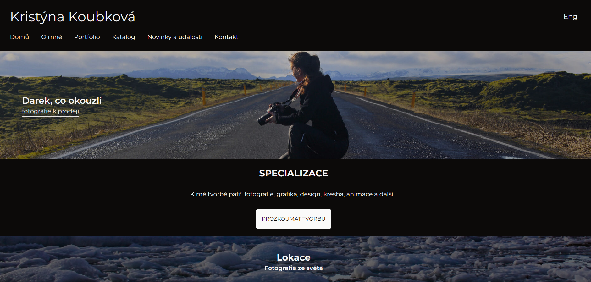

# Portfolio Website Redesign for Kristyna

A complete redesign of a personal portfolio website for [Profession, e.g., a photographer/artist/designer]. Built with a modern React stack, it features a responsive design, smooth animations, multi-language support, and a functional contact form.



## 🚀 Live Demo

[View the live website here](https://kristyna-portfolio-v2.vercel.app/)

## 🛠️ Tech Stack

-   **Framework:** React 19
-   **Build Tool:** Vite
-   **Language:** JavaScript (JSX)
-   **Styling:** Tailwind CSS 4
-   **Internationalization:** i18next, react-i18next
-   **Routing:** React Router DOM v7
-   **Email Service:** EmailJS
-   **Interactions:** React Swipeable (for image carousel)
-   **Code Quality:** ESLint, Prettier
-   **Icons:** Custom SVG Components

## 📦 Project Setup

1.  **Clone the repository:**
    ```bash
    git clone https://github.com/your-username/kristyna_redisign.git
    cd kristyna_redisign
    ```

2.  **Install dependencies:**
    ```bash
    npm install
    ```

3.  **Start the development server:**
    ```bash
    npm run dev
    ```
    Open [http://localhost:5173](http://localhost:5173) to view it in the browser.

## 🏗️ Building for Production

To create an optimized production build:

```bash
npm run build
